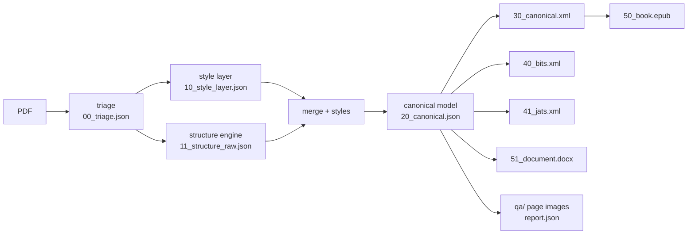
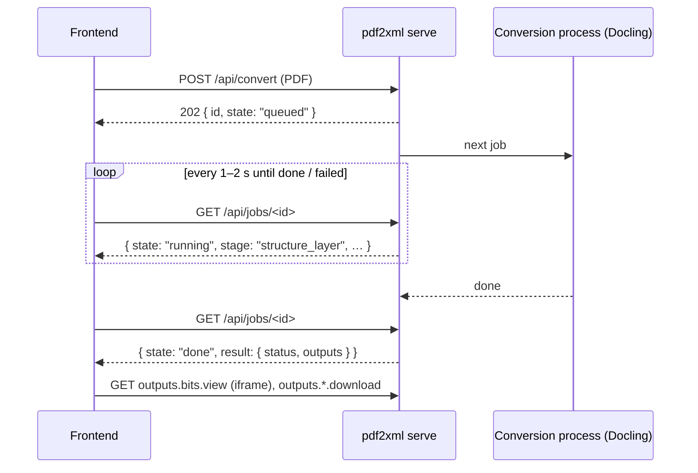

# pdf2xml — backend handover to the frontend team

| | |
|---|---|
| Backend version | **0.3.1** (see `CHANGELOG.md`) |
| Date | 2026-09-29 |
| Backend owner | _name / email — fill in_ |
| Frontend owner | _name / email — fill in_ |
| Code | `releases/pdf2xml-0.2.x-*.zip`, or this repository |

This document is the contract between the backend (the `pdf2xml` Python package) and the frontend. It covers what the backend does, how to run it, the files it writes, the HTTP API, the data formats, and what the backend does **not** do yet. Every route and field below was checked against the code and against real responses.

---

## 1. What the backend does

`pdf2xml` converts born-digital PDFs (no scans, no OCR) into structured files:



- **Input:** one PDF with a real text layer. Encrypted and scanned PDFs are rejected with an error.
- **Output:** one folder per PDF, `out/<pdf-name>/`, holding every stage (section 4).
- **Structure engines:** `docling` (ML models, accurate, about 40 s to load the models and then about 1–2 s per page) or `heuristic` (fast, no table detection). `auto` uses Docling when it is installed.
- **Publishing XML:** BITS 2.2 (books and chapters) and JATS 1.4 (articles). A whole book gets its contents, front matter, chapters and back matter; chapter PDFs get one chapter.

## 2. What the frontend gets, and what it does not get (yet)

| Area | Available now | Not available yet (see section 9) |
|---|---|---|
| **Upload and convert** | `POST /api/convert` (the PDF + options) → job; `GET /api/jobs/<id>` for state, stage and outputs; cancel (section 5.2). Runs Docling by default | Keeping the job list across server restarts |
| Browse conversions | `GET /api/docs` lists every conversion folder and its XML files | Search, paging, sorting |
| Show results | Rendered HTML preview, source, validation, report, page images, downloads | — |
| Re-export with a profile | **Command line only** (`pdf2xml export`) | HTTP endpoint |
| Hosting | Local server on `127.0.0.1:8765`, one user; CORS for a dev server (`--cors-origin`) | Authentication, serving your built app, network deployment |
| Errors | JSON `{error, message}` on the conversion routes; plain text on the viewing routes | JSON everywhere |

The complete flow is **upload PDF → Docling conversion → show S4C, BITS and JATS XML**. It works today; `http://127.0.0.1:8765/upload` is a working reference page for it (section 7).

> **Naming: "S4C XML" is our product name for the canonical XML.** In the UI, label it **S4C XML**. In the API and on disk it keeps its technical names: the file `30_canonical.xml`, the job output key `canonical_xml`, and the stylesheet id `canonical`. Don't rename those.

> **Important:** the server has **no authentication** and listens on localhost only. Do not expose it on a network as it is.

## 3. Running the backend on your machine

### Requirements
- Windows, macOS or Linux; **Python 3.11–3.13**.
- Optional: Docling (`uv sync --extra ml`, which pulls PyTorch, several GB). Without it, use `--engine heuristic`.
- Java is only needed to run the backend's EPUB tests, not for the frontend.

### Install
```powershell
# with uv (recommended)
uv sync
# or with the existing virtual environment in the project folder
.venv\Scripts\python.exe -m pip install -e .
```
Below, `pdf2xml` means `uv run pdf2xml` or `.venv\Scripts\pdf2xml.exe`.

### Make sample data
```powershell
pdf2xml convert tests\fixtures\pdfs\simple\simple.pdf -o out --engine heuristic   # seconds
pdf2xml convert tests\fixtures\pdfs\simple\table.pdf  -o out --engine heuristic
pdf2xml convert tests\fixtures\pdfs\paper\two_column.pdf -o out --engine heuristic
pdf2xml convert my-book.pdf -o out --engine docling            # a real book: minutes
```
Exit code: `0` when every PDF converted, `1` when one was rejected (encrypted or scanned).

### Start the API server
```powershell
pdf2xml serve out                      # http://127.0.0.1:8765, opens a browser; uploads on
pdf2xml serve out --port 9000 --no-browser
pdf2xml serve out --port 0             # any free port; the URL is printed
pdf2xml serve out --xslt house.xsl     # adds a custom stylesheet (id "custom1")
pdf2xml serve out --cors-origin http://localhost:5173   # let your dev server call the API
pdf2xml serve out --engine heuristic   # default engine for uploads (docling | heuristic | auto)
pdf2xml serve out --max-upload-mb 500  # largest PDF accepted (default 300)
pdf2xml serve out --no-convert         # viewing only: no uploads
```
The server reads the `out/` folder at every request. New conversions appear without a restart. Uploaded PDFs are kept in `out/_uploads/<job id>/`; the results go to `out/<name>/`, the same as `pdf2xml convert`.

## 4. The output folder contract

Each conversion writes `out/<name>/`. `<name>` is the PDF file name without `.pdf`, and it is the `doc` value in every API call. Converting the same PDF again overwrites its folder.

| File | What it is | For the frontend |
|---|---|---|
| `report.json` | Summary: status, checks, warnings, stats, timings (section 6.1) | **Main status source.** Via `/api/report` |
| `40_bits.xml` | BITS 2.2 XML (book or chapter) | Preview, source, validate, download |
| `41_jats.xml` | JATS 1.4 XML (article) | Preview, source, validate, download |
| `30_canonical.xml` | The canonical model as XML | Preview with the `canonical` sheet |
| `20_canonical.json` | The canonical model (section 6.2) | Block boxes, styles, page sizes. Via `/files` |
| `50_book.epub` | EPUB 3 (reflowable) | Download |
| `51_document.docx` | Word document | Download |
| `qa/page-001.png` … | Each PDF page with the detected blocks drawn on it (scale 1.5; 3-digit page number) | Page viewer. Via `/files` |
| `assets/p<page>_<block>.png` | Figure images cut from the pages (scale 2) | Referenced by the XML and EPUB |
| `00_triage.json` | Encrypted? tagged? pages? document type? | Optional details |
| `10_style_layer.json`, `11_structure_raw.json` | Internal stages, **very large** (a 352-page book: 77 MB and 4 MB) | Do not load in the browser |

Not every file exists for every run: `--to` selects the outputs, and `--no-overlays` skips `qa/`. Use `/api/docs` and `/api/report` to see what is there.

## 5. HTTP API reference

### Conventions
- **Base URL:** `http://127.0.0.1:8765` (the port is configurable).
- **Methods:** `GET` for viewing; `POST` and `DELETE` for conversions (section 5.2). Parameters are in the query string or the path.
- **Encoding:** URL-encode every path segment and parameter (`encodeURIComponent`). Folder names can contain spaces and non-ASCII characters.
- **Responses:** JSON (`application/json; charset=utf-8`), plain text, HTML or files. Every response has `Cache-Control: no-store`.
- **Errors:** the conversion routes answer JSON `{error, message}` (section 5.2). The viewing routes answer a status code plus a **plain-text** body:

| Status | When | Body example |
|---|---|---|
| `400` | A required parameter is missing | `bad request: 'file'` |
| `404` | Unknown route, folder, file or stylesheet, or a path outside the output folder | `not found: no conversion folder '..'` |
| `500` | Unexpected server error (the server keeps running) | `RuntimeError: …` |

- **Safety:** every path is resolved and must stay inside the output folder (`../` gives 404). Only `.xml` files can be rendered, validated or read as source.

### Routes

**Conversion** (section 5.2; JSON errors):

| Route | Returns |
|---|---|
| `POST /api/convert` | Upload a PDF and start its conversion → `202` + the job |
| `GET /api/jobs` | All jobs since the server started, newest first |
| `GET /api/jobs/<id>` | One job: state, current stage, and its outputs when done |
| `DELETE /api/jobs/<id>` (or `POST /api/jobs/<id>/cancel`) | Cancel a queued or running job |
| `GET /upload` | The reference upload page |

**Viewing** (section 5.1; plain-text errors):

| Route | Returns |
|---|---|
| `GET /` | The built-in reference UI (`resources/preview/index.html`) |
| `GET /api/docs` | Conversions, their XML files and page counts, plus the stylesheets |
| `GET /api/report?doc=` | `report.json` of a conversion (`{}` when there is none) |
| `GET /api/pages?doc=` | PDF pages that have a QA image, and printed page number → PDF page |
| `GET /api/validate?doc=&file=` | Validation result of one XML file |
| `GET /api/source?doc=&file=` | The XML file as text |
| `GET /api/stamp?doc=&file=&sheet=` | A value that changes when the file or stylesheet changes (live reload) |
| `GET /view/<sheet>/<doc>/<file.xml>` | The XML rendered to HTML by a stylesheet |
| `GET /view/<sheet>/<doc>/<path>` | A file the rendered page links to (CSS, figures) |
| `GET /files/<doc>/<path>` | Any file inside the conversion folder (downloads, images, JSON) |

### 5.1 Viewing routes

#### `GET /api/docs`
```json
{
  "root": "C:\\…\\out",
  "docs": [
    { "name": "simple", "files": ["40_bits.xml", "41_jats.xml", "30_canonical.xml"], "pages": 2 }
  ],
  "sheets": [
    { "id": "proof", "name": "BITS / JATS proof (built-in)", "path": "…\\jats-preview.xsl", "builtin": true },
    { "id": "canonical", "name": "Canonical → XHTML (EPUB sheet)", "path": "…\\canonical-to-xhtml.xsl", "builtin": true }
  ]
}
```
- `docs` is sorted by name, case-insensitively. Folders without XML files, and folders starting with `_` or `.`, are left out.
- `files` lists `40_bits.xml`, `41_jats.xml`, `30_canonical.xml` first, then any other XML.
- `pages` is the number of QA page images (0 when overlays were not made).
- `sheets`: `proof` renders BITS/JATS; `canonical` renders `30_canonical.xml`; `custom1…N` come from `--xslt` or from `.xsl` files in `out/_xslt/`.
- `root` and `path` are local file paths, for display only.

#### `GET /api/report?doc=simple`
See section 6.1 for every field.

#### `GET /api/pages?doc=simple`
```json
{ "pages": [1, 2], "folios": { "1": 1, "2": 2 } }
```
- `pages`: PDF page numbers (1-based) that have `qa/page-NNN.png`.
- `folios`: **printed** page number (a string, which can be roman: `"vii"`) → PDF page. Use it for "go to printed page 134", and to resolve the XML page targets (`<target id="page_134">`).

#### `GET /api/validate?doc=simple&file=40_bits.xml`
```json
{ "schema": "bits", "errors": [] }
```
- `schema`: `bits`, `jats-archiving`, `jats-publishing`, `jats-authoring`, `canonical (RelaxNG)`, or `well-formedness` (when the file is not even well-formed XML).
- `errors`: up to 500 items `{ "line": 12 | null, "message": "…" }`. `line` refers to the file as returned by `/api/source`.

#### `GET /api/source?doc=simple&file=40_bits.xml`
The XML as `text/plain`. Book files are large (a 352-page book: about 1.3 MB). Use a virtualised or lazy code view.

#### `GET /api/stamp?doc=simple&file=40_bits.xml&sheet=proof`
```json
{ "stamp": "1790674852629986100-1790652355947390500-…" }
```
An opaque string: compare it, don't parse it. It changes when the XML, the stylesheet, or a `.xsl`/`.css` file beside the stylesheet changes. The reference UI polls it every 1.2 s and reloads the preview when it changes.

#### `GET /view/<sheet>/<doc>/<file.xml>`
- A complete HTML page. Show it in an `<iframe>`; its relative links (CSS, figures) resolve under `/view/<sheet>/<doc>/…`.
- A large book can take several seconds to render, so show a loading state. The server gives up after 300 s.
- Renders run one at a time on the server. Don't fire many in parallel.
- **On a stylesheet or XML error:** status `500` with a readable HTML error page. Show it in the iframe too.
- With the `proof` sheet, every element carries:
  - `data-tag`: the XML element name.
  - `data-line`: its line in `/api/source`.
  - The element's `id`.

  With these the UI can highlight tags and jump from the preview to the source line.
- Special classes in the proof sheet:
  - `pv-unknown`: an element the sheet has no rule for.
  - `pv-broken`: a link or contents entry whose target is missing.
  - `pv-page`: a page marker, with the printed page in `data-page`.

#### `GET /files/<doc>/<path>`
Any file in the conversion folder, with its MIME type:

| Path | MIME type |
|---|---|
| `qa/page-001.png` | `image/png` |
| `50_book.epub` | `application/epub+zip` |
| `51_document.docx` | `application/vnd.openxmlformats-officedocument.wordprocessingml.document` |
| `40_bits.xml` | `application/xml` or `text/xml`, depending on the OS |
| `20_canonical.json` | `application/json` |

Use it for download buttons (`<a href download>`) and the page viewer.

### 5.2 Conversion routes: upload → convert → outputs



Conversions run **one at a time**, in the order they were uploaded, in one background process. The first Docling job loads the models (about 40 s); later jobs reuse them. A 14-page chapter took 55 s in total, including the model load; a 350-page book takes about 10 minutes.

#### `POST /api/convert`
Send the PDF in one of two ways:

| Way | Body | File name | Options |
|---|---|---|---|
| Raw (simplest with `fetch`) | the PDF bytes, `Content-Type: application/pdf` | `X-Filename` header (URL-encoded) or `?filename=` | query string |
| Form (`FormData`, HTML form) | `multipart/form-data` with a `file` field | the file's name | query string or other form fields |

| Option | Values | Default |
|---|---|---|
| `engine` | `docling`, `heuristic`, `auto` | `docling` (server option `--engine`) |
| `to` | comma list of `json,xml,epub,docx,bits,jats` | all |
| `pages` | e.g. `1-20` or `1-3,7` | all |
| `overlays` | `true` / `false` (the QA page images) | `true` |

```js
// raw upload with fetch
const r = await fetch(`/api/convert?engine=docling`, {
  method: "POST", body: file,
  headers: { "Content-Type": "application/pdf", "X-Filename": encodeURIComponent(file.name) } });
const job = await r.json();            // 202: the job; 4xx: { error, message }
```

Response `202 Accepted` + `Location: /api/jobs/<id>` + the job (below). The output folder name (`doc`) is the file name made safe: letters, digits and combining marks of any script are kept (Tamil names stay readable), other characters become `_`, and a leading `_` or `.` is dropped. **Uploading the same file name again replaces that folder's results.**

#### `GET /api/jobs/<id>`
A job while it runs:
```json
{
  "id": "6b735318ebe5", "doc": "Giardino00443_R1_Ch11_135-148",
  "filename": "Giardino00443_R1_Ch11_135-148.pdf",
  "options": { "engine": "docling", "to": ["json","xml","epub","docx","bits","jats"],
               "pages": null, "overlays": true },
  "state": "running", "stage": "structure_layer", "stage_index": 2, "stage_count": 9,
  "error": null, "created": "2026-09-29T15:40:02", "started": "2026-09-29T15:40:02",
  "finished": null, "elapsed_s": 12.4, "result": null,
  "links": { "self": "/api/jobs/6b735318ebe5" }
}
```
The same job when done (`result` filled):
```json
"state": "done", "stage": null, "elapsed_s": 55.2,
"result": {
  "status": "check", "warnings": 7,
  "report": "/api/report?doc=Giardino00443_R1_Ch11_135-148",
  "outputs": {
    "bits": { "file": "40_bits.xml", "view": "/view/proof/Giardino00443_R1_Ch11_135-148/40_bits.xml",
              "download": "/files/Giardino00443_R1_Ch11_135-148/40_bits.xml",
              "source": "/api/source?doc=…&file=40_bits.xml", "validate": "/api/validate?doc=…&file=40_bits.xml" },
    "jats": { … same keys, 41_jats.xml … },
    "canonical_xml": { … same keys, 30_canonical.xml, rendered with the "canonical" sheet … },
    "canonical_json": { "file": "20_canonical.json", "download": "…" },
    "epub": { "file": "50_book.epub", "download": "…" },
    "docx": { "file": "51_document.docx", "download": "…" }
  }
}
```

| Field | Meaning |
|---|---|
| `state` | `queued` → `running` → `done` / `failed` / `cancelled` |
| `stage` | While running: `style_layer`, `structure_layer` (Docling, the long step), `merge_build`, `figures`, `xml`, `epub`, `docx`, `bits_jats`, `overlays` |
| `stage_index` / `stage_count` | For a progress bar. Stages the job skips (outputs not requested) never appear, and fast stages may pass between two polls |
| `error` | When `failed`: a readable reason. For example `…: no usable text layer; …` for a scanned PDF, `…: encrypted PDF (password required)`, or `the conversion process stopped unexpectedly …` |
| `result.status` | `ok`, `check` (valid, with warnings), `invalid`, or `unknown` (the same rule as section 6.1) |
| `result.outputs` | Only the outputs that were written. `view` exists for the three XML files: show it in an iframe |
| `elapsed_s` | Seconds since the job started running (total, when finished) |

Poll every 1–2 s while `queued` or `running`, then stop.

#### `GET /api/jobs`
`{ "jobs": [ job, … ] }`, newest first. Jobs are kept in memory: after a server restart the list is empty, but the conversion folders stay (use `/api/docs`).

#### `DELETE /api/jobs/<id>` or `POST /api/jobs/<id>/cancel`
Cancels a queued job, or stops a running one. Stopping a running job restarts the background process, so the next Docling job loads the models again. Returns the job with `state: "cancelled"`. A finished job gives `409 finished`.

#### Conversion errors
Body: `{ "error": "<code>", "message": "<text for people>" }`.

| Status | `error` | When |
|---|---|---|
| 400 | `not_pdf` | The upload is not a PDF |
| 400 | `bad_engine`, `bad_targets`, `bad_pages` | An option is wrong |
| 400 | `docling_missing` | `engine=docling`, but Docling is not installed on the server |
| 400 | `no_file` | A form without a `file` field |
| 403 | `origin` | The request comes from a web page of another origin that was not allowed with `--cors-origin` |
| 404 | `no_job` / `not_found` | Unknown job id or route |
| 409 | `finished` | Cancelling a job that has already finished |
| 411 | `no_body` | Empty upload |
| 413 | `too_large` | Larger than `--max-upload-mb` (default 300 MB) |
| 503 | `disabled` | The server runs with `--no-convert` |

A failed **conversion** is not an HTTP error: the job reaches `state: "failed"` with `error` filled.

## 6. Data formats

### 6.1 `report.json`

| Field | Type | Meaning |
|---|---|---|
| `source` | string | PDF file name |
| `engine` | string | `docling` or `heuristic` |
| `coverage.ok` | bool | Every character of the PDF text is in the output exactly once |
| `coverage.ratio` | number 0–1 | Share of the PDF text found |
| `coverage.missing` / `.extra` | object char → count | What is missing or duplicated (empty when `ok`) |
| `xml_valid` | bool | `30_canonical.xml` is valid |
| `xml_errors` | string[] | Up to 20 errors |
| `warnings` | string[] | Conversion warnings, human-readable |
| `stats` | object | `artifacts`, `dehyphenated`, `orphan_words`, `promoted_headings` |
| `styles` | string[] | Style names found (`body`, `h1` …) |
| `blocks` | int | Number of top-level blocks |
| `exports.bits` / `exports.jats` | object | `file`, `schema`, `valid` (bool), `errors` (≤ 20), `warnings` (string[]), `stats` (object) |
| `timings_s` | object stage → seconds | `style_layer`, `structure_layer`, `merge_build`, `figures`, `xml`, `epub`, `docx`, `bits`, `jats`, `overlays` |

**Suggested status badge:**

| Badge | When |
|---|---|
| OK | `coverage.ok && xml_valid && every exports[*].valid` |
| Check | All of the above, but there are warnings |
| Invalid | Any of `coverage.ok`, `xml_valid` or an export's `valid` is false |

**Treat these as open-ended:**
- `exports.*.stats` keys depend on the document. Show whatever keys are present; new keys can be added in any version. Keys seen today:
  - For every document: `sections`, `references`, `references_tagged`, `footnotes`, `tables`, `figures`, `lists`, `formulas`, `boxes`, `xrefs`, `ext_links`, `page_markers`, `paragraphs_joined`, `running_heads_dropped`, `queries`.
  - For whole books: `chapters`, `front_matter`, `back_matter`, `toc_entries`, `toc_linked`, `toc_linked_to_page`, `index_entries`, and `matter_*` counts.
- Warnings are sentences, not codes. Show them as text; don't build logic on their wording. Common prefixes you may group by:
  - `page N: …` (words the layout engine missed on a page).
  - `TOC: …` (contents entries that match no heading).
  - `… reference(s) not tagged granularly`.
  - `… author-year citation(s) match no reference`.
- `pdf2xml export` updates `exports` in `report.json`. `/api/stamp` does not watch `report.json`, so fetch it again after an export.

### 6.2 `20_canonical.json` (the canonical model)
The full JSON Schema is `src/pdf2xml/resources/schemas/canonical.schema.json`. The main shape:

```text
{ meta: { source, sha256, pages, doc_type, title, lang, engine, warnings[], stats{} },
  styles: { "<name>": { font, size, bold, italic, color, role, level, … } },
  pages:  [ { n, width, height } ],                 // PDF points
  body:   [ Block ],   footnotes: [ Block ],   references: [ Block ],
  artifacts: [ { kind, page, bbox, text } ] }       // running heads, page numbers …

Block = one of (field "type"):
  heading | paragraph | caption | code | formula | list (items: list_item[]) |
  list_item | table (rows: cells[][]) | figure (image: "assets/…png") | box (children: Block[])
  common fields: id, page, bbox [x0, y0, x1, y1], style, runs [ { text, bold?, italic?, … } ]
```

- **Coordinates:** PDF points (1/72 inch), origin at the **top-left** of the page, rounded to 2 decimals.
- **Drawing a block box on `qa/page-NNN.png`:** `pixel = (point − origin) × 1.5`. `origin` is `(0, 0)` for normal PDFs. For printer's PDFs, which have crop marks around the page, it is the crop-box corner (for example 30 pt). The API does not expose it yet (section 9, item 5).
- Runs store only what differs from the block's style. Resolve formatting as `run value ?? styles[block.style] value`.

### 6.3 BITS / JATS XML
- DTD-valid against the official NLM DTDs. `/api/validate` confirms it.
- IDs follow patterns such as `ch1`, `sec12`, `fig3`, `ref4`, `fn2`, `toc1` and `page_vii`. They are stable across runs of the same input, but may change when the input or the profile changes.
- **Whole book:** `book` → `book-meta`, `front-matter` (including `toc`), `book-body/book-part` (parts and chapters), `book-back` (index, glossary, appendices …).
- **Chapter:** `book-part-wrapper` → one `book-part`.
- **Page targets:** `<target id="page_134" target-type="page"/>` marks where each printed page begins. Use `/api/pages` → `folios` to reach the PDF page.

## 7. The reference UI

`src/pdf2xml/resources/preview/index.html` is a single file of about 520 lines, with no build step, served at `/`. It uses only the API above, so it shows every integration pattern:

| Pattern | How the reference UI does it |
|---|---|
| Lists | `/api/docs` fills the document, file and stylesheet pickers |
| Preview | An `<iframe src="/view/<sheet>/<doc>/<file>">` |
| Live reload | Polls `/api/stamp` every 1.2 s and reloads the iframe when the value changes |
| Preview → source | A click on an element in the iframe reads `data-line` and scrolls the source view (`/api/source`) to that line |
| Checks | Panels for `/api/validate` (errors with line links) and `/api/report` (warnings, stats) |
| Pages | `/api/pages` plus `/files/<doc>/qa/page-NNN.png`; printed page → PDF page through `folios` |
| Preferences | `localStorage` keys prefixed `pv.` |

Start from it when you design the new UI. Behaviour already there should keep working.

**`/upload`** (`src/pdf2xml/resources/preview/upload.html`, about 230 lines) is the reference for the conversion flow:
- Drag-and-drop or choose a PDF, pick the engine and pages.
- Raw `POST /api/convert`.
- Poll `GET /api/jobs/<id>` every 1.5 s, with a progress bar from `stage_index` / `stage_count` and a readable name for each stage.
- Cancel.
- When done: tabs for the BITS, JATS and canonical XML previews (`outputs.*.view` in an iframe), download links, and the recent-jobs list (`GET /api/jobs`).
- All server text is shown with `textContent`, never `innerHTML`.

## 8. Integration notes

1. **Same origin, proxy or CORS.** A frontend served from another origin (e.g. a Vite dev server on `:5173`) has two options:
   - **Proxy (recommended):** proxy the three prefixes, so the browser sees one origin:
     ```js
     // vite.config.js
     export default { server: { proxy: {
       '/api': 'http://127.0.0.1:8765', '/view': 'http://127.0.0.1:8765', '/files': 'http://127.0.0.1:8765' } } }
     ```
   - **CORS:** start the server with `--cors-origin http://localhost:5173`. The API then answers the preflight and sends `Access-Control-Allow-Origin` for that origin. Iframes of `/view/…` work either way.

   Upload, cancel and every other write from a web page of **any other origin** are refused (`403 origin`). This stops a random web site from using the local server. For production, see section 9, item 2.
2. **Long work.** Rendering a book, and validation (DTD checks of MB-sized files), can take seconds. Show progress, and don't retry automatically before 300 s.
3. **Large text.** `/api/source` and validation lists can be large for books; paginate or virtualise them.
4. **Polling.** Poll `/api/stamp` for the one file on screen only, about once a second. Pause polling while the tab is hidden.
5. **Folder names** come from PDF file names. Always encode them in URLs and escape them in HTML.
6. **Treat content as untrusted.** Report warnings and XML text come from the PDF. Render them as text (never `innerHTML`), except the `/view` HTML, which belongs in its own iframe.
7. **For backend developers:** if Python code embeds the server (`pdf2xml.preview.make_server`), guard the entry point with `if __name__ == "__main__":`. On Windows the XSLT worker starts as a new process and re-imports the script. `pdf2xml serve` already does this correctly.

## 9. Open points: backend work to agree on

These are the gaps between today's backend and a typical web UI. Priorities are a proposal for the kickoff.

| # | Need | Today | Proposed backend change | Priority |
|---|---|---|---|---|
| 1 | Upload a PDF and convert it from the UI | **Done in 0.3.0** (section 5.2). Still open: keeping jobs across restarts, a per-job profile/metadata upload | Job store on disk; `profile` / `metadata` fields in the upload | Low |
| 2 | Serve the new frontend in production | CORS for configured origins is **done**; `/` still serves only the built-in page | A static-files route for the built app (e.g. `--ui dist/`) | **High** |
| 3 | Users, access control | None; localhost only; foreign-origin writes refused | Decide the deployment first (desktop tool vs shared server). A server needs auth and HTTPS through a reverse proxy | **High** (decision) |
| 4 | Machine-readable errors | JSON on the conversion routes; plain text on the viewing routes | JSON `{ "error": code, "message": text }` on every route | Medium |
| 5 | Draw block boxes on page images | Crop-box origin not exposed | Add `origin` and `scale` per page to `/api/pages` | Medium |
| 6 | Re-export with another profile or metadata | CLI `pdf2xml export` | `POST /api/export` (doc, targets, profile, metadata) | Medium |
| 7 | Delete or rename a conversion | Manual | `DELETE /api/docs/<doc>` | Low |
| 8 | Warnings the UI can act on | Sentences | Warning objects `{ code, page?, message }` alongside the text | Low |

The whole upload → convert → view flow can be built now, against `pdf2xml serve` with the proxy or `--cors-origin`.

## 10. Test data and checks

- **Small samples:** the three PDFs in `tests/fixtures/pdfs/` (convert them as in section 3; they take seconds).
- **Real books:** use your own born-digital PDFs with `--engine docling`. Client PDFs are not part of the package.
- **Edge cases to test in the UI:**
  - A conversion without `qa/` (`--no-overlays`).
  - A folder with only `30_canonical.xml` (`--to json,xml`).
  - An invalid export (`valid: false`, `errors` filled).
  - A book with roman page numbers (`folios` keys `i`, `ii` …).
  - A PDF name with spaces.
  - A stylesheet error (500 HTML page in the iframe).
  - Uploads: a non-PDF (`400 not_pdf`), a scanned PDF (job `failed` with a reason), two uploads at once (the second waits `queued`), cancel while running, a Tamil or other non-Latin file name.
- **Backend checks** (for backend changes): `pytest -m "not slow"` (includes `tests/unit/test_jobs.py`, which drives the real upload API), `ruff check src tests`, `mypy src`.

## 11. Versions and change policy

- The version is in `pyproject.toml`; changes are listed in `CHANGELOG.md`; each release is a zip in `releases/` made with `python tools/package.py`.
- **Stable within 0.3.x:**
  - Route paths and parameters.
  - The fields listed in sections 5 and 6.1.
  - The output file names in section 4.
- **May grow at any time:** new `stats` keys, new warnings, new stylesheet ids, new XML elements in the exports (the proof sheet marks elements it does not know with `pv-unknown`).
- Breaking API changes get a minor version bump (0.4.0) and a note here.

## 12. Glossary

| Term | Meaning |
|---|---|
| Canonical model | The backend's own document format (`20_canonical.json` / `30_canonical.xml`), the source of all exports |
| S4C XML | The name shown to users for the canonical XML (`30_canonical.xml`, output key `canonical_xml`) |
| BITS / JATS | NLM XML standards for books and journal articles |
| Folio | The page number printed on a page (may differ from the PDF page number, may be roman) |
| QA overlay | A page image with the detected blocks drawn on it |
| Front / back matter | Pages before and after the chapters: contents, preface, index, glossary … |
| Profile / metadata | YAML files that tune the BITS/JATS output (`examples/profiles`, `examples/metadata`) |
| Engine | The layout analyser: `docling` or `heuristic` |
